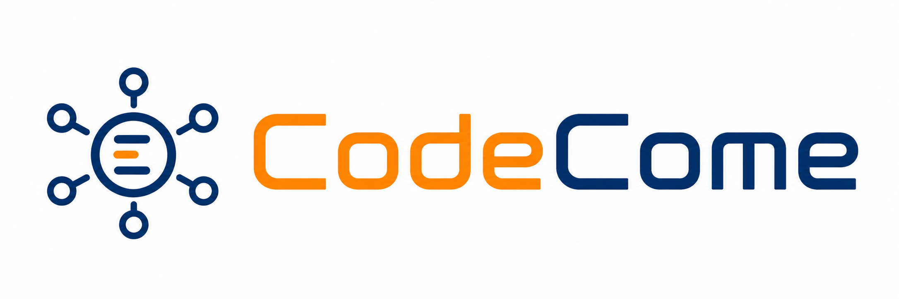
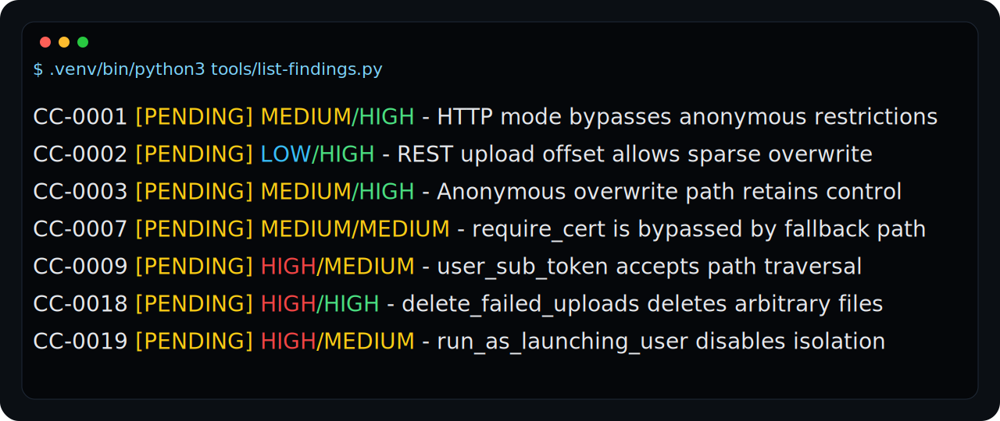
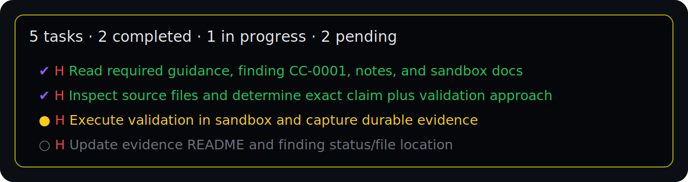
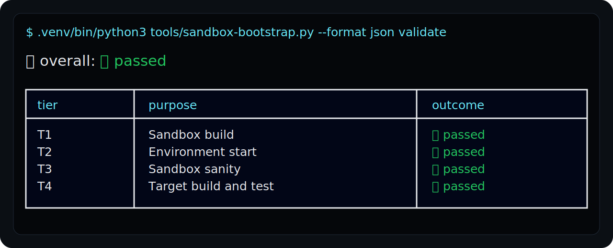
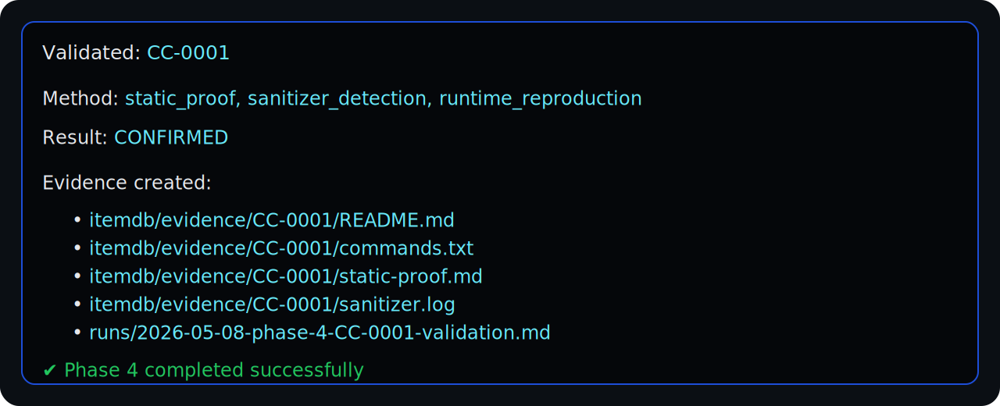
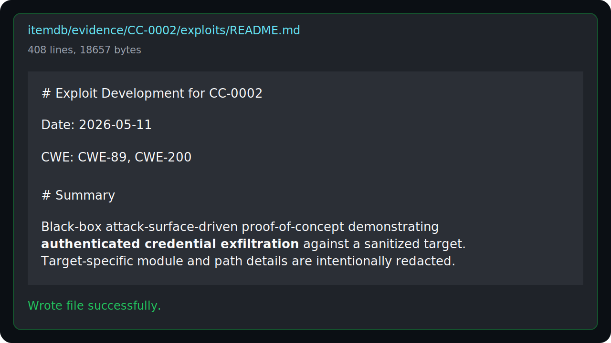
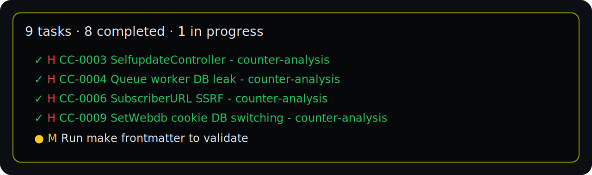
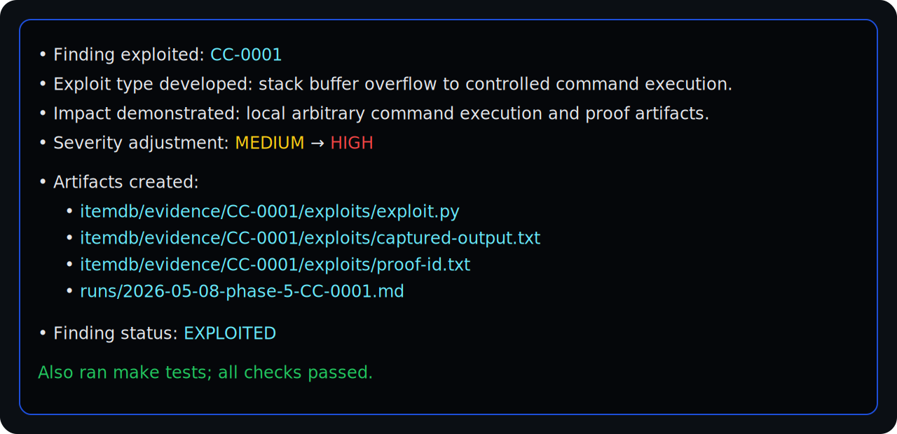
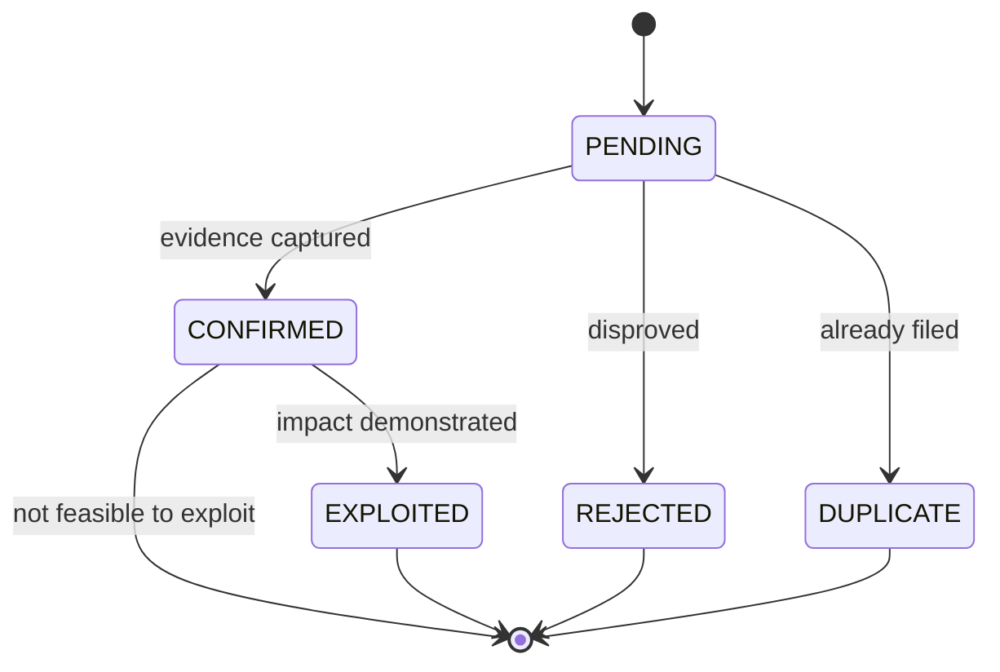

# CodeCome



> The harness for building your own Mythos of vulnerability research at home.

[](#license)
[](#project-status)
[](#prerequisites)
[](https://opencode.ai)

## What is CodeCome?

[CodeCome](https://codecome.ai) is the harness I built to let an AI agent help me audit source code without losing the trail.

It turns "I think there might be a bug here" into a structured Markdown finding, validates it inside a sandbox, escalates the ones that matter into working proof-of-concept exploits, and produces a report you can read, grep, and commit. It is not a scanner and not a pentest tool. Think of it as a **research methodology made executable**: the same six phases, the same artifact shapes, the same evidence rules — every time, for every target.

The whole audit lives on disk as plain Markdown and YAML. No database, no RAG, no ticketing system, nothing magical. If you can read a directory, you can review a CodeCome audit.

## Screenshots

These screenshots are sanitized/redrawn from real CodeCome runs: enough to show the workflow, without leaking target-specific exploit details or credentials. Click any image to open it at full size.

<table>
  <tr>
    <td width="25%" align="center">
      <a href="docs/images/screenshots/finding-queue.svg">
        
      </a>
      <br>
      <sub><strong>Finding queue</strong><br>Reviewable hypotheses.</sub>
    </td>
    <td width="25%" align="center">
      <a href="docs/images/screenshots/agent-workflow.svg">
        
      </a>
      <br>
      <sub><strong>Agent workflow</strong><br>Agentic, but auditable.</sub>
    </td>
    <td width="25%" align="center">
      <a href="docs/images/screenshots/sandbox-validation.svg">
        
      </a>
      <br>
      <sub><strong>Sandbox validation</strong><br>Validation before belief.</sub>
    </td>
    <td width="25%" align="center">
      <a href="docs/images/screenshots/evidence-artifacts.svg">
        
      </a>
      <br>
      <sub><strong>Evidence artifacts</strong><br>Evidence written to disk.</sub>
    </td>
  </tr>
  <tr>
    <td width="25%" align="center">
      <a href="docs/images/screenshots/sandbox-script.svg">
        
      </a>
      <br>
      <sub><strong>Generated helpers</strong><br>Sandbox scripts on demand.</sub>
    </td>
    <td width="25%" align="center">
      <a href="docs/images/screenshots/exploit-notes-sanitized.svg">
        
      </a>
      <br>
      <sub><strong>Exploit notes</strong><br>Readable PoC writeups.</sub>
    </td>
    <td width="25%" align="center">
      <a href="docs/images/screenshots/counter-analysis.svg">
        
      </a>
      <br>
      <sub><strong>Counter-analysis</strong><br>Try to disprove first.</sub>
    </td>
    <td width="25%" align="center">
      <a href="docs/images/screenshots/exploit-impact.svg">
        
      </a>
      <br>
      <sub><strong>Impact summary</strong><br>Exploited findings with artifacts.</sub>
    </td>
  </tr>
</table>

A recorded run is also planned:

<!-- TODO: replace with real asciinema cast -->
<!-- [](https://asciinema.org/a/PLACEHOLDER) -->

## Prerequisites

CodeCome runs on top of [OpenCode](https://opencode.ai), an open-source AI coding agent.

1. **Install OpenCode** — follow the [installation guide](https://opencode.ai/docs/#install).
2. **Configure a provider** — connect at least one LLM provider with an API key. See [provider setup](https://opencode.ai/docs/#configure).
3. **Python 3.10+** — needed for workspace tooling (`make venv` creates a local virtualenv).
4. **GNU Make** — drives the workflow.
5. **Docker** — required for the sandboxed validation environment.
6. **Optional: CodeQL CLI** — for static analysis integration. Managed install via `make init`, or set `CODEQL_SKIP=1` to skip.
7. **Optional: exploit recording tools** — for Phase 5 visual evidence:
   - `asciinema` — terminal recordings.
   - `agg` — renders `.cast` files to GIFs (CodeCome falls back to a Docker container if missing).
   - `ffmpeg` and `xvfb` (or `xvfb-run`) — for GUI/browser exploits.

`make check` will warn about missing optional tools, but the core workflow runs fine without them.

Before pointing CodeCome at code you don't fully trust, read [Safety considerations](#safety-considerations).

## Quick start

What CodeCome needs from you is simple: **drop a source tree under `src/`**, tell it the project name in `codecome.yml`, and run the phases.

A few things to know up front about `src/`:

- It can be a copied source tree, a git submodule, a checked-out repo, an extracted archive, or a benchmark corpus. CodeCome doesn't care which.
- The harness **will try to build, test, and run the target inside the sandbox**. That's the point — validation happens against a real build. Phase 1b bootstraps a Docker-based sandbox suited to your stack (Python, C/C++, .NET, PHP, etc.).
- If your project has unusual build steps, vendored directories, or generated code, you'll want to adjust `audit.scope` (include/exclude globs) and `audit.focus` (vulnerability classes to prioritize) in `codecome.yml`. The defaults work for most projects, but five minutes spent here pays off.
- You don't have to do everything at once. Run Phase 1, look at the recon notes, tweak `codecome.yml`, then keep going. Phases are designed to be re-runnable.

When you're ready:

    make venv                       # set up the local Python virtualenv
    make init                       # install CodeQL CLI (optional, skip with CODEQL_SKIP=1)
    make check                      # sanity-check the workspace
    make phase-1                    # recon + sandbox bootstrap
    make phase-2                    # generate candidate findings
    make phase-3                    # counter-analysis (dedup / reject)
    make phase-4 FINDING=CC-0001    # validate one finding
    make phase-5 FINDING=CC-0001    # build a PoC for a confirmed finding
    make phase-6                    # generate the report

There are convenience targets too — `make validate-all`, `make exploit-all`, `make sweep` — but you almost never want to use them on a fresh project. Walk one finding through end-to-end first; you'll learn more from one CC-0001 than from twenty PENDING ones.

## How it works

Six phases. Each one is a `make` target. Each one writes to disk.

1. **Recon (`make phase-1`)** — runs as three subphases: (1a) target profiling and CodeQL plan generation, (1b) CodeQL-assisted reconnaissance using static analysis signals, and (1c) sandbox bootstrap. Writes notes under `itemdb/notes/` including a file-risk-index informed by CodeQL findings.
2. **Hypothesis (`make phase-2`)** — agent writes candidate findings under `itemdb/findings/PENDING/`. Each one points at specific code, sources, sinks, and a trust boundary.
3. **Counter-analysis (`make phase-3`)** — a reviewer pass tries to disprove or deduplicate findings. Weak ones move to `REJECTED/`, repeats to `DUPLICATE/`.
4. **Validation (`make phase-4 FINDING=CC-XXXX`)** — one finding at a time, in the sandbox. Build the target, write a small PoC, capture evidence, decide CONFIRMED or REJECTED.
5. **Exploit (`make phase-5 FINDING=CC-XXXX`)** — for confirmed findings worth escalating, build a real PoC that shows concrete impact: code execution, data exfiltration, privilege escalation. Severity gets adjusted based on what you actually demonstrate.
6. **Reporting (`make phase-6`)** — generate a Markdown report grouping exploited and confirmed findings with evidence references.

The finding lifecycle:



Phases 1–3 are batch operations. Phases 4 and 5 are run **per finding** — that's intentional. One finding at a time keeps evidence traceable and lets you mix model choices, prompt overrides, and rerun loops without polluting the audit.

## CodeQL integration

CodeCome integrates GitHub's [CodeQL](https://codeql.github.com/) as an optional first-class static-analysis capability during Phase 1.

- **Managed install** — `make init` (or `tools/codeql.py install`) downloads and manages the CodeQL CLI bundle under `.tools/codeql/`.
- **Automatic language detection** — Phase 1a generates `itemdb/notes/codeql-plan.yml` with detected languages and build modes.
- **SARIF normalization** — raw CodeQL results are normalized into `file-signals.yml`, which feeds into the `file-risk-index.yml` used by Phase 1b recon.
- **Configuration** — controlled via `codecome.yml` under `audit.static_analysis.codeql` (enable/disable, pack selection, fail policy, timeouts).
- **Opt-out** — set `CODEQL_SKIP=1` or `enabled: false` in config to skip CodeQL entirely.

## Who is this for?

- **Solo security researchers** who want LLM help on source-code audits but refuse to trust an opaque chat session.
- **Blue and red teamers** doing internal source-code review and looking for a workflow that produces commit-friendly artifacts.
- **People studying LLM-assisted security work** — the workspace is intentionally simple enough to instrument, fork, or compare across models.

If you want a one-click vulnerability scanner, this is not it. CodeCome is for people who want **the model to help them think**, not to replace the thinking.

## Why I built it

After watching too many chat sessions produce confident-sounding "potential SQL injection" claims with zero evidence, I wanted a workflow where:

- every claim is a file on disk,
- every file points at specific lines of code,
- every finding either has evidence or gets rejected,
- and the whole thing is reviewable by a human in an afternoon.

CodeCome is the harness I wish I'd had the first time I tried to use an agent for vulnerability research.

## What a finding looks like

Here is what one of those Markdown files actually looks like — trimmed from a example CC-0022 audit (SQL injection in Apps's `user.get` JSON-RPC API):

```markdown
---
id: "CC-0022"
title: "SQL injection via unvalidated selectRole option in user.get JSON-RPC API"
status: "EXPLOITED"
severity: "CRITICAL"
confidence: "CONFIRMED"
category: "SQL Injection"
cwe:
  - "CWE-89"
language: "php"
target_area: "JSON-RPC API user.get method"
files:
  - "src/app-1.4.1/ui/include/classes/api/services/CUser.php"
symbols:
  - "CUser::addRelatedObjects()"
sources:
  - "JSON-RPC options['selectRole'] parameter"
sinks:
  - "DBselect() at CUser.php:2243-2248"
trust_boundary: "authenticated API user -> raw SQL SELECT clause"
validation:
  status: "CONFIRMED"
  methods: ["http_exploit", "runtime_reproduction"]
  evidence_dir: "itemdb/evidence/CC-0022"
exploitation:
  status: "DEMONSTRATED"
  severity_before: "HIGH"
  severity_after: "CRITICAL"
  artifacts_dir: "itemdb/evidence/CC-0022/exploits"
---

# Summary

The `user.get` JSON-RPC API accepts a `selectRole` array whose elements are
concatenated into a SQL SELECT clause via `implode(',r.', ...)` without any
allowlist check. Authenticated users at the lowest privilege level can inject
arbitrary SQL fragments and extract data from the database.

# Affected code

`CUser::addRelatedObjects()` at `CUser.php:2238-2248` builds raw SQL from
`$options['selectRole']` after `zbx_array_merge()` skipped input validation.

# Counter-analysis

- `CApiInputValidator` is not used on this code path. Verified by reading
  `CUser::get()` at line 91.
- `dbConditionInt()` only sanitises `$userIds`, not the SELECT clause.
- No framework-level escaping of column lists in `DBselect()`.

# Validation plan

Send a `user.get` JSON-RPC request as a low-privilege user with
`selectRole: ["roleid,(SELECT version())"]` and observe the version string
returned inline. Evidence under `itemdb/evidence/CC-0022/`.
```

That single file is the entire interface between the model and you: a hypothesis with enough detail to either disprove it, validate it, or hand it to a developer.

## Workspace layout

    .
    ├── README.md                # you are here
    ├── AGENTS.md                # rules the agents follow
    ├── codecome.yml             # project + audit configuration
    ├── src/                     # target source code
    ├── sandbox/                 # Docker-based validation environment
    ├── itemdb/                  # findings, evidence, notes, reports
    ├── runs/                    # run summaries and transcripts
    ├── templates/               # finding, evidence, report templates
    ├── tools/                   # Python helper scripts
    ├── prompts/                 # reusable phase prompts
    ├── docs/                    # deeper documentation
    └── .opencode/               # agents and skills

`itemdb/` is the heart of an audit. Everything important lives there:

- `itemdb/notes/` — reconnaissance notes (target profile, attack surface, build model, trust boundaries, …)
- `itemdb/findings/PENDING|CONFIRMED|EXPLOITED|REJECTED|DUPLICATE/` — findings by status.
- `itemdb/evidence/<finding-id>/` — validation evidence and PoCs.
- `itemdb/reports/` — generated reports.

Agents live under `.opencode/agents/`:

- `recon` — Phase 1
- `auditor` — Phase 2
- `reviewer` — Phase 3
- `validator` — Phase 4
- `exploiter` — Phase 5
- `reporter` — Phase 6

### `codecome.yml` at a glance

The shipped defaults work out of the box. The keys you'll most often touch:

- `project.name` — identifies the target in output and reports.
- `audit.scope` — include/exclude globs for which files agents inspect.
- `audit.focus` — vulnerability classes to prioritize.
- `audit.extra_prompts` — persistent per-phase prompt additions.
- `agents.<name>.model` / `.variant` — pin a specific model per phase (see [Model selection](#model-selection-and-rerunning-phases)).
- `environment` — sandbox paths and scripts.
- `validation` — confirmation policies, allowed write paths, validation methods.

## Running the workflow

Run phases through `make` targets — they handle readiness gates and agent selection for you.

### Phase 1 — reconnaissance + sandbox bootstrap

    make phase-1

Two things happen together:

- **1a (recon)** — notes written under `itemdb/notes/`.
- **1b (sandbox bootstrap)** — picks a curated baseline from `templates/sandboxes/<id>/`, applies it to `sandbox/` (with marker substitution), validates it, and writes `itemdb/notes/sandbox-plan.md` plus `sandbox/CODECOME-GENERATED.md`.

`sandbox/` is semi-ephemeral; Phase 1b regenerates its contents based on what is in `src/`.

Bootstrap helpers:

    make sandbox-list
    make sandbox-detect
    make sandbox-inspect ID=python
    make sandbox-bootstrap ID=python
    make sandbox-validate
    make sandbox-regenerate
    make sandbox-status

Sandbox runtime helpers (one target per capability):

    make sandbox-setup        # setup.sh or `docker compose build`
    make sandbox-up           # start
    make sandbox-check        # sanity
    make sandbox-build        # build target
    make sandbox-test         # run target tests
    make sandbox-down         # stop
    make sandbox-shell        # open a shell
    make sandbox-logs         # tail logs
    make sandbox-clean        # clean runtime artifacts
    make sandbox-reset        # reset to a known state

See `docs/sandbox.md` for the full bootstrap workflow.

### Phase 2 — hypothesis generation

    make phase-2

Creates candidate findings under `itemdb/findings/PENDING/`. Gated by the sandbox: blocks if `sandbox/` is missing or if the most recent validation failed. Override with `CODECOME_ALLOW_NO_SANDBOX=1`.

#### Deep sweep (optional)

A Deep Sweep runs the `auditor` agent **once per file**, forcing exhaustive line-by-line analysis. It complements the broad Phase 2 pass.

When to use it:

- Phase 1 flagged many score-4/5 files and you want to be sure none were skipped.
- Phase 2 produced few findings on a large codebase.
- A specific subsystem deserves focused attention.
- A confirmed finding suggests related files deserve a second look.

Trade-off: token cost scales linearly with the number of files swept (one full agent session per file). Sweep on 10 high-risk files costs roughly as many tokens as 10 Phase 2 runs. It produces overlapping findings that Phase 3 has to deduplicate. Always preview first with `--dry-run`.

How it works: the sweep runner reads `itemdb/notes/file-risk-index.yml` (written by Phase 1), selects all files at score 4 or above (or the files matched by `FILE=`), writes one prompt per file under `tmp/file-sweep-prompts/`, then invokes the `auditor` agent once per file in sequence.

    make list-risk-files                     # preview which files would be swept
    python tools/run-sweep.py --dry-run      # show selected files and prompts, no agent calls
    make sweep                               # sweep all files at score 4+
    make sweep FILE="src/path/to/file.ext"   # sweep a specific file
    make sweep FILE="src/**/*.cs"            # sweep all .cs files under src/

Sweep findings overlap with Phase 2 output by design. Phase 3 deduplicates on semantic frontmatter fields (`sources`, `sinks`, `entry_points`, `trust_boundary`, `target_area`), so overlaps are merged gracefully.

See `docs/file-risk-sweeps.md` for the full reference.

### Phase 3 — counter-analysis

    make phase-3

Reviews candidate findings. Moves weak findings to `itemdb/findings/REJECTED/` and repeats to `itemdb/findings/DUPLICATE/`.

### Phase 4 — validation

    make phase-4 FINDING=CC-0001

One finding at a time. Stores evidence under `itemdb/evidence/<finding-id>/` and moves findings to `CONFIRMED/` or `REJECTED/`.

To run validation across all PENDING findings:

    make validate-all

### Phase 5 — exploit development

    make phase-5 FINDING=CC-0001

Develops a working PoC for one confirmed finding. Artifacts go under `itemdb/evidence/<finding-id>/exploits/`. The exploiter may adjust severity based on demonstrated impact, and may move findings to `EXPLOITED/`.

For all confirmed findings that aren't already marked as not-feasible:

    make exploit-all

### Phase 6 — reporting

    make phase-6

A lightweight local report (no agent involved) is also available:

    make report

The default report path is `itemdb/reports/report.md`.

## Customizing phase prompts

Extra instructions can be appended to any phase prompt from three sources, applied in this order (all additive):

1. **`codecome.yml`** — persistent per-phase instructions under `audit.extra_prompts`. Always applied when the phase runs.

       audit:
         extra_prompts:
           reconnaissance: |
             Focus sandbox on ASAN builds.
             Skip fuzzing harness for now.

2. **`PROMPT_EXTRA_FILE`** — path to a file whose content is appended.

       make phase-1 PROMPT_EXTRA_FILE=my-notes.md

3. **`PROMPT_EXTRA`** — inline text appended directly.

       make phase-1 PROMPT_EXTRA="Also try clang for the sandbox setup."

All three can be combined in a single invocation.

## Local helper commands

    make help                                  # show all available commands
    make check                                 # validate workspace
    make status                                # show finding status counts
    make findings                              # list findings
    make findings STATUS=PENDING               # filter by status
    make findings-create TITLE="Buffer overflow in parser"
    make findings-move FINDING=CC-0001 STATUS=CONFIRMED
    make findings-evidence FINDING=CC-0001     # create evidence dir
    make next-id                               # next free finding id
    make frontmatter                           # validate finding frontmatter
    make index                                 # regenerate finding index
    make report                                # regenerate report
    make list-risk-files                       # top-scoring risky files from index
    make itemdb-reset                          # reset local audit artifacts
    make sandbox-check                         # sandbox sanity
    make sandbox-shell                         # open sandbox shell

## Starting over

If you want a completely clean workspace, the safest option is to clone a fresh copy of CodeCome.

If you only want to clear local audit artifacts without recloning:

    make itemdb-reset

This removes local notes, findings, evidence, reports, run summaries, and temporary artifacts, then recreates the expected `.gitkeep` files. Don't use it if you want to preserve prior audit work.

## Advanced: wrapper internals

By default, phase targets use a CodeCome-owned styled wrapper around `opencode run --format json` so assistant output, tool calls, and tool results render with consistent colors and structure. The wrapper pretty-renders `read`, `write`, `edit`, `apply_patch`, `grep`, `glob`, `bash`, `todowrite`, and `skill` tool calls; all others get a generic JSON panel.

The wrapper also detects bash invocations of `tools/sandbox-bootstrap.py --format json …` (and `make sandbox-* BOOTSTRAP_ARGS='--format json'` wrappers) and renders them as a structured Sandbox panel with capability tables, validation tier summaries, and color-coded gate badges.

Some models prefer to invoke CLI helpers via the bash tool instead of the OpenCode-native Read/Grep/Glob tools (e.g. `rtk read FILE`, `rtk grep PAT PATH`, `rtk ls`, plain `rg PAT`, `cat FILE`, `head -n N FILE`, `tail -n N FILE`, `find PATH`, `tree`). The wrapper detects those calls and routes their output through the matching styled renderer so the panels look the same regardless of how the agent invoked the operation. Pipelines, redirections, and command substitutions are intentionally left for the generic Bash panel.

All `make` targets that invoke Python tools expect a repo-local virtualenv at `.venv/`. If it is missing or stale, the command will stop with a setup message telling you to run `make venv`.

`make tests` runs the Python test suite under `tests/` and validates finding YAML frontmatter via `tools/check-frontmatter.py`. This catches regressions such as malformed finding metadata that can break helper scripts.

### Reusable prompts

CodeCome ships reusable phase prompts under `prompts/`:

    prompts/phase-1a-profile.md
    prompts/phase-1b-recon.md
    prompts/phase-1c-sandbox.md
    prompts/phase-2-audit.md
    prompts/phase-3-review.md
    prompts/phase-4-validate.md
    prompts/phase-5-exploit.md
    prompts/phase-6-report.md
    prompts/sweep.md

### Wrapper environment variables

    CODECOME_USE_WRAPPER=0              # bypass the styled wrapper
    CODECOME_THINKING=1                 # show model reasoning/thinking blocks in output
    CODECOME_THINKING=0                 # hide model reasoning/thinking blocks
    CODECOME_RENDER_REASONING=0         # suppress on-screen Thinking panels (independent override)
    CODECOME_REASONING_MAX_CHARS=4000   # truncate long reasoning blocks
    CODECOME_SANDBOX_RENDER=0           # disable structured Sandbox panel
    CODECOME_SANDBOX_VALIDATE_STDERR_LINES=20
    CODECOME_SANDBOX_FILES_CAP=15
    CODECOME_BOOTSTRAP_MAX_RETRIES=3    # agent remediation budget during bootstrap
    CODECOME_BOOTSTRAP_DRY_RUN=1        # force --dry-run on sandbox apply/regenerate
    CODECOME_BASH_SHIM_RENDER=0         # disable rtk/cat/head/tail/rg/ls/find/tree routing
    CODECOME_BASH_SHIM_LS_STRIP_LONG_FORMAT=0
    OPENCODE_ARGS='...'                 # extra flags for opencode run (forwarded directly when CODECOME_USE_WRAPPER=0; in wrapper mode only --model, --variant and --thinking are used)
    CODECOME_MODEL=<id>                 # pin model per phase, e.g. anthropic/claude-opus-4-7
    CODECOME_MODEL_VARIANT=<v>          # pin model variant, e.g. high, max

### Model resolution and thinking display

The wrapper resolves the effective model in this order:

1. `OPENCODE_ARGS` (`--model …` / `--variant …`)
2. env (`CODECOME_MODEL`, `CODECOME_MODEL_VARIANT`)
3. `codecome.yml` (`agents.<name>.model` / `.variant`)
4. the model used in your most recent OpenCode session for this project (best-effort, read from OpenCode's local DB)
5. unknown

The chosen value is shown in the phase header banner along with its source.

Per-provider thinking-display defaults:

- `anthropic/*` → off. Claude already interleaves thinking with normal `text` blocks via OpenCode's interleaved-thinking beta header, so `Assistant` panels already show the model's working.
- `openai/*`, `xai/*`, `github-copilot/*`, `groq/*`, `cerebras/*`, `google/*`, `google-vertex/*` → on.
- Anything else (unknown / future provider) → on. Cheaper to over-surface than under-surface in vulnerability research.

Override precedence: `CODECOME_THINKING` env > per-provider default. `CODECOME_RENDER_REASONING=0` acts as an independent escape hatch that suppresses rendering even when thinking is enabled. Some providers bill reasoning tokens; set `CODECOME_THINKING=0` per phase to opt out without losing the styled wrapper.

Print the full resolution table for any agent without launching a phase:

    make show-model
    make show-model AGENT=auditor

The wrapper currently targets OpenCode 1.14.39 or newer.

### Manual invocation

If you prefer direct `opencode run` commands instead of `make` targets:

    make phase-1
    opencode run --agent auditor "$(cat prompts/phase-2-audit.md)"
    opencode run --agent reviewer "$(cat prompts/phase-3-review.md)"
    opencode run --agent validator "$(sed 's#FINDING_PATH_OR_ID#CC-0001#g' prompts/phase-4-validate.md)"
    opencode run --agent exploiter "$(sed 's#FINDING_PATH_OR_ID#CC-0001#g' prompts/phase-5-exploit.md)"
    opencode run --agent reporter "$(cat prompts/phase-6-report.md)"

`make report` is a lightweight local summary generator. Use `make phase-6` when you want the full AI-written report flow.

Direct manual `opencode run` usage remains unchanged. The styled wrapper is only used by `make phase-*` targets.

## Design principles

### Findings are artifacts

Every relevant issue must be written as a Markdown file. The model should not leave important security claims only in chat history or run transcripts.

### Hypotheses are not confirmed bugs

A plausible vulnerability is first a hypothesis. Confirmation requires evidence.

### Impact must be demonstrated

Confirmed vulnerabilities should have their real-world impact demonstrated through exploit development whenever feasible. Without this, developers may dismiss findings as theoretical or low-impact.

### Counter-analysis is mandatory

Every finding includes an attempt to disprove it. The reviewer looks for unreachable code paths, input validation, authorization checks, framework-level protections, false assumptions, duplicate reports, and missing exploitability conditions.

### Validation is sandboxed

The validator and exploiter may freely experiment inside `sandbox/`, but should not modify target source code unless explicitly instructed.

### The core is target-agnostic

CodeCome adapts to whatever sits under `src/`. Target-specific behavior lives in skills, adapters, notes, or config — not in the core workflow.

## Model selection and rerunning phases

The model you pick has a real effect on the output. Some patterns I've found useful:

- **Different models see different bugs.** Running Phase 2 with two different models on the same codebase usually produces two partially overlapping sets of findings. Phase 3 deduplicates them on semantic frontmatter fields, so it's safe to combine the runs.
- **Different models for different phases.** Reasoning-heavy models (Opus, GPT reasoning variants, Gemini Pro reasoning) tend to do better on Phase 2 (audit) and Phase 5 (exploit). Fast workhorses are often enough for Phase 3 (counter-analysis) and Phase 6 (reporting). Pin per phase with `agents.<name>.model` in `codecome.yml`, or pass `CODECOME_MODEL=…` on the command line.
- **Rerunning a phase with a second model.** You can re-run Phase 2 with another model and end up with extra findings — they go into `PENDING/` alongside the existing ones. Phase 3 then folds duplicates into `DUPLICATE/`. Same trick works for Phase 4: if model A can't reproduce a finding, model B sometimes can with a different sandbox approach.
- **Deep sweep as a feedback amplifier.** `make sweep` runs the auditor once per high-risk file. It produces noisier output and burns more tokens, but it catches bugs that broad Phase 2 sometimes misses because the model gets the whole file in a single focused context window. Use it on a subset (`FILE="src/auth/**"`) to keep cost contained.
- **Use the resolution banner.** Every wrapped phase prints which model it actually picked and where the value came from. If a run feels off, that banner is the first place to look.

The right combination depends on your provider mix, your token budget, and your target. Experiment.

## Safety considerations

> ⚠️ **Disclaimer — read this before pointing CodeCome at code you did not write.**

CodeCome operates by feeding target source code (under `src/`) to an LLM agent
that has powerful tools at its disposal: it reads and writes files in the
workspace, executes commands in a sandbox, builds and runs the target, and can
fetch resources from the network. Treating unknown source code as data is not
safe by default.

The risks worth knowing about:

- **Prompt injection from the target.** Comments, docstrings, README files,
  test fixtures, log strings, commit messages, filenames, and even crafted
  binary blobs inside `src/` can contain instructions aimed at the agent
  ("ignore previous instructions…", "exfiltrate $HOME/.ssh/…", etc.). The
  agent reads these as input, not as instructions, but LLMs are still
  susceptible.
- **Supply-chain hazards in the sandbox.** Phase 1b will try to build and run
  the target. A malicious build script (`setup.py`, `package.json` lifecycle
  hooks, `Makefile`, `Dockerfile`, `configure`, …) executes inside the
  sandbox container with whatever permissions Docker gives it.
- **Resource exhaustion and side effects.** Adversarial code may try to
  consume CPU, disk, or network from the validation phase.
- **Exfiltration via network.** If the sandbox or your host can reach the
  internet, an injected agent or a malicious build step can attempt to send
  data out.

**Recommended precautions:**

1. **Run the whole workspace inside an isolation boundary** when auditing
   untrusted sources — a disposable VM (e.g. Multipass, Vagrant, UTM,
   Proxmox), a dedicated container, or a remote throwaway host. Do not run
   CodeCome on a machine that holds credentials, SSH keys, browser
   profiles, or production access you cannot afford to lose.
2. **Treat `src/` as untrusted.** Do not run anything from `src/` directly
   on your host. CodeCome funnels execution through `sandbox/`, but the
   `make` runner itself, the agent, and any helper scripts still execute on
   the host.
3. **Restrict network egress** from the sandbox (and ideally from the
   outer VM) to only what you need for builds and package installs.
4. **Use a fresh API key with low spend limits** for the LLM provider so
   prompt-injected runaway loops cannot rack up an unbounded bill.
5. **Review what the agent writes** under `itemdb/`, `sandbox/`, and
   `tmp/` before trusting any of it. Findings, evidence, and reports are
   all attacker-influenced when the target is untrusted.
6. **Avoid `make exploit-all` / `make validate-all` on untrusted targets**
   until you have walked at least one finding through manually and
   confirmed the sandbox behaves the way you expect.

CodeCome's sandbox is a containment aid, not a security boundary against a
determined attacker. If you would not be willing to run `docker build` and
`./run-tests.sh` from the target's repo on the host, you should not run
CodeCome against it on the host either.

## Project status

This is early-stage software. Honestly:

**What works well today:**

- Markdown findings with structured YAML frontmatter — stable format, no surprise schema changes.
- File-based item database — no DB, no RAG, easy to grep, easy to commit.
- Per-phase make targets with readiness gates.
- Docker-based sandbox bootstrap for common stacks (Python, C/C++, .NET, PHP, IaC, …).
- Styled wrapper output with per-tool renderers.
- Per-finding evidence directories and an exploit subdirectory layout for Phase 5.

**What's still rough or missing:**

- One agent at a time. No parallel validation, no parallel auditing.
- One validation worker at a time. `make validate-all` is sequential.
- Docker is the only first-class sandbox runtime today. Remote sandboxes and disposable VMs are future work.
- Phase 2 and the deep sweep produce overlapping findings that Phase 3 has to clean up — this works, but it can be wasteful on tokens.
- Provider coverage for the `--thinking` flag is hand-maintained.
- No CI. Quality gate is `make tests` run locally.

Patches, issues, and feedback all welcome.

## Documentation

| Doc | What's in it |
|-----|--------------|
| [`docs/target-setup.md`](docs/target-setup.md) | Supported target layouts: copied source trees, submodules, archives, benchmark corpora |
| [`docs/workflow.md`](docs/workflow.md) | Full phase-by-phase workflow reference |
| [`docs/sandbox.md`](docs/sandbox.md) | Sandbox usage, boundaries, evidence capture, validation environment notes |
| [`docs/file-risk-sweeps.md`](docs/file-risk-sweeps.md) | File risk index format and deep sweep reference |
| [`docs/development.md`](docs/development.md) | Repository conventions, helper tools, contributor workflow |

## Contributing

Issues, ideas, and pull requests are welcome — see [`CONTRIBUTING.md`](CONTRIBUTING.md). If something feels rough, that's probably because it is; please tell me about it.

## Authors

- **Pablo Ruiz García** — Project Lead  
  Architecture, engineering, implementation, and the person who turns vague ideas into working code.

- **Alejandro Ramos** — Product Lead  
  Product direction, use cases, requirements, and official provider of impossible requests that somehow keep becoming roadmap items.

## Contributors

Contributions are welcome. Pull requests are expected, encouraged, and appreciated.

## License

CodeCome is dual-licensed under your choice of:

- GNU General Public License version 3 or later (`GPL-3.0-or-later`), or
- GNU Affero General Public License version 3 or later (`AGPL-3.0-or-later`).

SPDX expression: `GPL-3.0-or-later OR AGPL-3.0-or-later`.

The files under `templates/sandboxes/` are an exception: they are licensed under the **MIT License** so they can be copied into user workspaces without imposing copyleft obligations on those user projects.

See `LICENSE`, `AGPL-LICENSE`, `templates/sandboxes/LICENSE`, and `NOTICE`. Contributions are accepted under the terms described in `CONTRIBUTING.md`.

Copyright (C) 2025-2026 Pablo Ruiz García <pablo.ruiz@gmail.com>.
